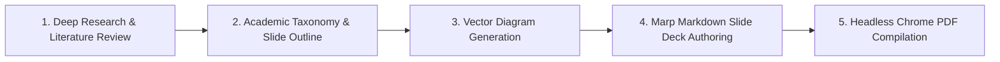

# Scientific Slide Authoring & PDF Export Skill

This skill provides an end-to-end framework for authoring scientifically rigorous, visually stunning, and academic-grade presentation slides for technical workshops, conferences, and hackathons, complete with vector diagrams, mathematical foundations, speaker cues, and automated PDF compilation.

## 1. Core Workflow



---

## 2. Methodology & Scientific Rigor Guidelines

When authoring technical and scientific slide decks:
1. **Mathematical & Architectural Accuracy:**
   - Always define mathematical formulas with LaTeX notation ($\LaTeX$).
   - Explicitly define variables, domains, and assumptions (e.g., sample rates, window sizes $\Delta t$, distribution parameters).
   - Use standard engineering standards (e.g., ISO-10816, ISO-13373 for vibration, API 670 for machinery protection, IEEE/RFC standards for protocols).

2. **Visual Hierarchy & Diagram Placement:**
   - Every major architecture tier must have a dedicated vector diagram (`.svg` or `.png` located in `Diagram/`).
   - Use high-contrast, modern color-coded blocks (Dark mode / Cyber-slate palette with Cyan, Emerald, Amber, Violet).
   - Diagrams must clearly illustrate data flow, protocol layers, latency boundaries, and feedback loops.

3. **Speaker Turn-Taking & Pacing:**
   - Include presenter cues (`<!-- speaker: ... -->` or dedicated Speaker Script) specifying key talking points, time allocation (minutes), and interactive audience questions.

---

## 3. Marp Presentation Template & Configuration

Use the standard 16:9 Marp format with custom CSS styling:

```markdown
---
marp: true
theme: default
paginate: true
size: 16:9
style: |
  @import url('https://fonts.googleapis.com/css2?family=Outfit:wght@300;400;600;700;800&family=JetBrains+Mono:wght@400;700&display=swap');
  section {
    font-family: 'Outfit', sans-serif;
    background-color: #0b0f19;
    color: #e2e8f0;
    padding: 40px 60px;
  }
  h1 { color: #38bdf8; font-size: 2.2rem; font-weight: 800; }
  h2 { color: #00f0ff; font-size: 1.6rem; font-weight: 700; border-bottom: 2px solid rgba(0, 240, 255, 0.3); padding-bottom: 8px; }
  h3 { color: #a855f7; font-size: 1.25rem; font-weight: 600; }
  code { font-family: 'JetBrains Mono', monospace; background: rgba(255,255,255,0.08); color: #00f0ff; }
  strong { color: #f8fafc; }
  a { color: #38bdf8; }
---
```

---

## 4. Automated PDF Export Command

To compile the Marp Markdown file into a standalone, printable PDF using headless Chrome:

```bash
npx -y @marp-team/marp-cli <path-to-slide.marp.md> --pdf --allow-local-files -o <output-path.pdf>
```

Options:
- `--pdf`: Generates standard Adobe PDF with embedded fonts and selectable text.
- `--allow-local-files`: Ensures local images and diagrams in `Diagram/` are rendered properly.
- `--html`: Allows raw HTML tags (e.g. `<div class="grid">`) inside slides.
