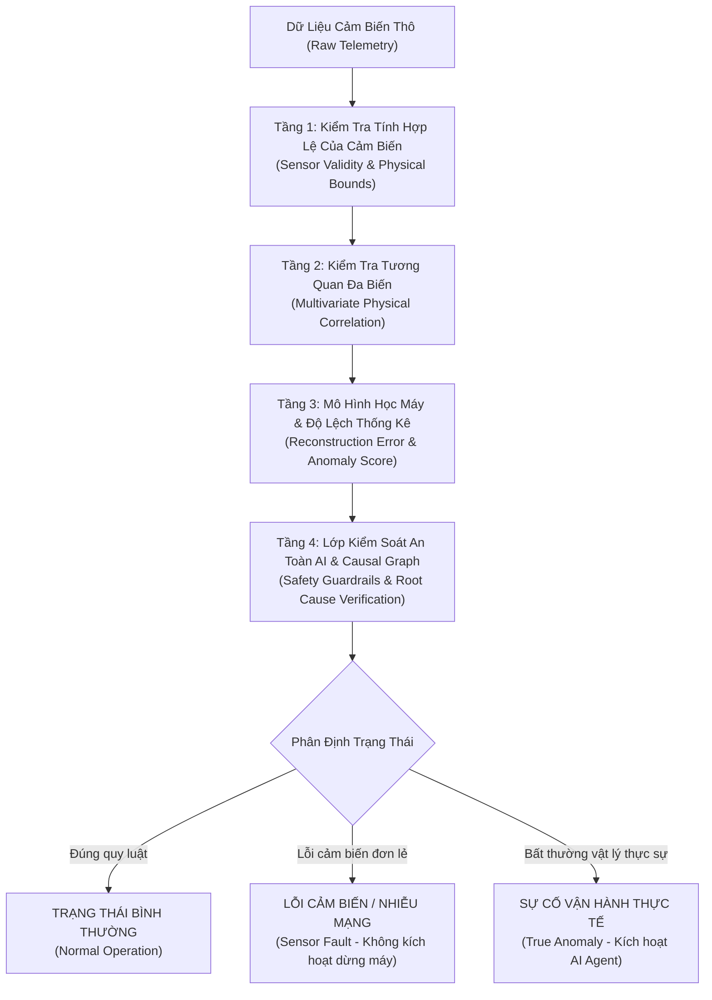

# WORKSHOP PRESENTATION SCRIPT & SLIDE DECK
## AI-Driven Smart Operations: From Real-Time IoT Data to Intelligent Decisions

- **Chủ đề (Topic):** AI-Driven Smart Operations: From Real-Time IoT Data to Intelligent Decisions
- **Sự kiện (Event):** SEAL Hackathon Summer 2026
- **Thời gian (Duration):** 20:00 - 21:30, August 13, 2026 (90 Phút)
- **Hình thức (Platform):** Trực tuyến qua Google Meet (Link: `https://meet.google.com/zbr-tktz-bea`)
- **Diễn giả (Sole Speaker):** Nguyễn Đức Tuấn (Backend Lead / System Architect, FPT Software & Cựu Google Student Ambassador)

---

# MỤC LỤC TỔNG QUAN

1. **PHẦN I: TỔNG QUAN WORKSHOP & PHÂN BỔ THỜI GIAN (90 MINUTES TIMETABLE)**
2. **PHẦN II: NGUYÊN LÝ CỐT LÕI - PHƯƠNG PHÁP XÁC ĐỊNH ĐÚNG/SAI TRONG VẬN HÀNH THÔNG MINH (GROUND TRUTH & ANOMALY BOUNDARIES)**
3. **PHẦN III: KỊCH BẢN THUYẾT TRÌNH CHI TIẾT THEO TỪNG PHẦN (PRESENTATION SCRIPT & TECHNICAL DEEP-DIVE)**
   - Phần 1: Khai mạc, Giới thiệu & Bối cảnh Smart Operations (10 phút)
   - Phần 2: Kiến trúc Thu thập & Xử lý Luồng Dữ liệu IoT Thời gian thực (20 phút)
   - Phần 3: Trí tuệ Nhân tạo & AI Agents trong Vận hành Tự động (25 phút)
   - Phần 4: Kiến trúc Tham chiếu (Reference Architecture) & Chiến lược Hackathon (15 phút)
   - Phần 5: Q&A Kỹ thuật & Giải đáp Thắc mắc (20 phút)
4. **PHẦN IV: BỘ SLIDE THUYẾT TRÌNH HOÀN CHỈNH (18 SLIDES - SONG NGỮ EN/VI)**
5. **PHẦN V: BẢNG TRA CỨU CÔNG NGHỆ & MA TRẬN SO SÁNH (TECH STACK DEEP-DIVE)**
6. **PHẦN VI: CHECKLIST VẬN HÀNH & BẢNG TIÊU CHÍ CHẤM ĐIỂM HACKATHON**

---

# PHẦN I: TỔNG QUAN WORKSHOP & PHÂN BỔ THỜI GIAN (90 MINUTES)

| Mốc thời gian | Thời lượng | Phân đoạn | Nội dung trọng tâm | Diễn giả |
| :--- | :---: | :--- | :--- | :---: |
| **20:00 - 20:10** | 10 phút | **Phần 1** | **Khai mạc, Giới thiệu & Bối cảnh Smart Operations**<br>• Chào mừng thí sinh SEAL Hackathon Summer 2026.<br>• Giới thiệu diễn giả & lộ trình 90 phút.<br>• Sự chuyển dịch từ giám sát thụ động sang vận hành thông minh bằng AI. | Nguyễn Đức Tuấn |
| **20:10 - 20:30** | 20 phút | **Phần 2** | **Kiến trúc Thu thập & Xử lý Luồng Dữ liệu IoT Thời gian thực**<br>• Giao thức thu thập: MQTT, CoAP, Kafka/Redpanda.<br>• Stream Processing Engine: Watermarking, Windowing (Tumbling/Sliding), Aggregation.<br>• Xử lý dữ liệu trễ mạng (Late Data) và chống rò rỉ dữ liệu. | Nguyễn Đức Tuấn |
| **20:30 - 20:55** | 25 phút | **Phần 3** | **Trí tuệ Nhân tạo & AI Agents trong Vận hành Tự động**<br>• Chuỗi 5 bước: Feature Extraction $\rightarrow$ Anomaly Detection $\rightarrow$ RCA $\rightarrow$ AI Agent $\rightarrow$ Action.<br>• Giải thuật: Isolation Forest, Autoencoder, Causal Graph, SHAP.<br>• Điều phối hành động tự động có kiểm soát an toàn (Safety Guardrails). | Nguyễn Đức Tuấn |
| **20:55 - 21:10** | 15 phút | **Phần 4** | **Kiến trúc Tham chiếu (Reference Architecture) & Tối ưu Hackathon**<br>• Blueprint chuẩn triển khai trong 2 giờ với Docker Compose.<br>• Tech stack tối ưu: FastAPI, Paho-MQTT, TimescaleDB, Grafana.<br>• Kỹ thuật "Live Anomaly Injection" tạo điểm nhấn trước Giám khảo. | Nguyễn Đức Tuấn |
| **21:10 - 21:30** | 20 phút | **Phần 5** | **Phiên Q&A & Giải đáp Trực tiếp cho Đội thi**<br>• Trực tiếp tháo gỡ vướng mắc kiến trúc, streaming, AI models.<br>• Cảnh báo các bẫy phổ biến (Pitfalls) và hướng dẫn bảo vệ đề tài. | Nguyễn Đức Tuấn |

---

# PHẦN II: NGUYÊN LÝ CỐT LÕI - PHƯƠNG PHÁP XÁC ĐỊNH ĐÚNG/SAI TRONG VẬN HÀNH THÔNG MINH

> **Câu hỏi lớn của thí sinh:** *"Làm sao trong một hệ sinh thái IoT với hàng ngàn cảm biến gửi dữ liệu liên tục, hệ thống biết được đâu là dữ liệu ĐÚNG (Bình thường), đâu là SAI (Bất thường/Lỗi cảm biến/Sự cố hệ thống) mà không gây ra báo động giả?"*

Để xác định **ĐÚNG / SAI** trong Smart Operations, hệ thống áp dụng **Ma trận Kiểm định Đa tầng (Multi-Layer Verification Matrix)** gồm 4 trục tiêu chuẩn:



### 1. Phân biệt Lỗi Cảm Biến (Sensor Fault) vs Sự Cố Hệ Thống (System Fault)
- **Lỗi cảm biến (Sensor Noise/Drift):** Chỉ duy nhất 1 cảm biến nhảy giá trị bất thường đột ngột trong khi các cảm biến vật lý liên đới xung quanh vẫn bình thường (Ví dụ: Cảm biến nhiệt độ báo $150^\circ\text{C}$ nhưng cảm biến áp suất và độ rung của cùng ổ bi không hề tăng). $\rightarrow$ **Xác định: Sai dữ liệu do cảm biến hỏng, bỏ qua không báo động.**
- **Sự cố hệ thống thực tế (True Anomaly):** Xuất hiện chuỗi tương quan đa biến theo quy luật nhiệt động lực học (Ví dụ: Áp suất giảm nhanh $\rightarrow$ Tốc độ quay tăng $\rightarrow$ Độ rung tăng theo $\rightarrow$ Nhiệt độ tăng sau 30 giây). $\rightarrow$ **Xác định: Sự cố cơ khí thực tế, kích hoạt quy trình ứng phó khẩn cấp.**

### 2. Định lượng ranh giới Đúng/Sai bằng Toán học
- **Z-Score & Rolling Interquartile Range (IQR):** Đánh giá độ lệch cục bộ trong cửa sổ trượt:
  $$Z = \frac{x_t - \mu_{\text{rolling}}}{\sigma_{\text{rolling}}}$$
  Nếu $|Z| > 3.0$ trên nhiều mẫu liên tiếp $\rightarrow$ Cảnh báo bất thường sơ cấp.
- **Reconstruction Error của Autoencoder:**
  $$\mathcal{L}(x, \hat{x}) = \frac{1}{d} \sum_{i=1}^d (x_i - \hat{x}_i)^2$$
  Nếu $\mathcal{L} > \text{Threshold}_{\alpha = 0.99}$ $\rightarrow$ Hệ thống đang ở trạng thái không thể tái tạo từ phân phối bình thường.

---

# PHẦN III: KỊCH BẢN THUYẾT TRÌNH CHI TIẾT (PRESENTATION SCRIPT)

## PHẦN 1: KHAI MẠC, GIỚI THIỆU & BỐI CẢNH SMART OPERATIONS (10 PHÚT)

### 1.1 Lời chào mừng & Giới thiệu Diễn giả
- **Kịch bản nói (Verbatim):**
  > *"Xin nhiệt liệt chào mừng toàn thể các đội thi, các kỹ sư và các bạn sinh viên tài năng đã có mặt trong buổi Workshop kỹ thuật trọng tâm của **SEAL Hackathon Summer 2026**!*
  >
  > *Tôi là **Nguyễn Đức Tuấn**, hiện đảm nhiệm vai trò Backend Lead và System Architect tại FPT Software, đồng thời là cựu Google Student Ambassador. Trong sự nghiệp của mình, tôi đã trực tiếp tham gia thiết kế và tối ưu các nền tảng phân tán xử lý hàng trăm nghìn sự kiện mỗi giây, kết hợp giữa tầng IoT Data Streaming hiệu năng cao với các giải pháp AI Agent tự động hóa vận hành.*
  >
  > *Hôm nay, trong 90 phút làm việc cùng nhau, tôi sẽ đồng hành cùng các bạn để làm sáng tỏ toàn bộ bức tranh: **Làm thế nào để chuyển đổi luồng dữ liệu IoT thô thành những quyết định điều hành thông minh mang lại giá trị kinh tế thực tế cho bài thi Hackathon của các bạn**."*

### 1.2 Sự tiến hóa 3 giai đoạn của Giám sát Vận hành
- **Giai đoạn 1: Traditional Passive Monitoring (Giám sát thụ động)**
  - *Bản chất:* Gom dữ liệu cảm biến và vẽ biểu đồ đường (Line Chart).
  - *Hạn chế:* Chỉ trả lời câu hỏi *"Điều gì đã xảy ra trong quá khứ?"*. Con người phải ngồi nhìn màn hình 24/7.
- **Giai đoạn 2: Reactive Threshold Alerting (Cảnh báo phản ứng ngưỡng tĩnh)**
  - *Bản chất:* Quy tắc cố định `IF Nhiệt_độ > 80°C THEN Gửi_Email`.
  - *Hạn chế:* Gây ra "Bão cảnh báo giả" (Alert Fatigue), không phát hiện được sự suy thoái từ từ hoặc lỗi đa biến.
- **Giai đoạn 3: AI-Driven Smart Operations (Vận hành thông minh chủ động)**
  - *Bản chất:* Kết hợp Real-time Streaming + Machine Learning + AI Agent để hoàn thành vòng lặp 4 bước: **Phát hiện (Detect) $\rightarrow$ Chẩn đoán gốc rễ (Diagnose) $\rightarrow$ Dự báo (Predict) $\rightarrow$ Tự động thi hành giải pháp (Act)**.

---

## PHẦN 2: KIẾN TRÚC THU THẬP & XỬ LÝ LUỒNG DỮ LIỆU IOT THỜI GIAN THỰC (20 PHÚT)

### 2.1 Sơ đồ Kiến trúc Luồng Dữ liệu (Real-Time Pipeline Architecture)

```
[Mạng Cảm Biến IoT] ──> (MQTT / CoAP) ──> [Eclipse Mosquitto / EMQX Broker]
                                                   │
                                                   ▼ (Gắn Metadata)
                                      [Apache Kafka / Redpanda Buffer]
                                                   │
                                                   ▼
                                      [Stream Processing Engine]
                                        ├── Bounded Watermarking (Xử lý trễ mạng)
                                        ├── Tumbling Window (1m) & Sliding Window (5m)
                                        └── Trích xuất đặc trưng & Tổng hợp thống kê
                                                   │
                                  ┌────────────────┴────────────────┐
                                  ▼                                 ▼
                     [Time-Series Storage]              [Real-Time AI Decision Engine]
                     (TimescaleDB Hypertables)          (Inference Latency < 5ms)
```

### 2.2 Phân tích các giao thức & công nghệ trọng yếu
1. **MQTT (Port 1883) & CoAP (Port 5683 UDP):**
   - MQTT dùng mô hình Publish/Subscribe qua TCP, overhead header chỉ 2 bytes, cực kỳ tối ưu cho mạng chập chờn.
   - CoAP chạy trên UDP, hướng tới các node cảm biến pin yếu (LPWAN, Zigbee, NB-IoT).
2. **Buffer chống tràn: Apache Kafka & Redpanda:**
   - Đóng vai trò lớp hấp thụ xung lực (Spike Buffer). Khi có sự cố hoặc lưu lượng tăng đột biến 100x, Kafka lưu vết trên đĩa dưới dạng Commit Log phân tán, bảo đảm **Zero Data Loss**.
   - **Redpanda:** Bản phân phối viết bằng C++, không phụ thuộc máy ảo JVM, độ trễ p99 thấp hơn Kafka 10 lần và tiết kiệm RAM vượt trội cho Hackathon.
3. **Kỹ thuật Windowing & Watermarking:**
   - **Event-Time vs Processing-Time:** Luôn sử dụng timestamp tại thời điểm cảm biến tạo ra gói tin ($T_{\text{event}}$), không dùng giờ của Server ($T_{\text{server}}$).
   - **Bounded-Out-Of-Orderness Watermark:**
     $$\text{Watermark} = \max(T_{\text{event}}) - T_{\text{allowed\_delay}}$$
     Cho phép hệ thống kiên nhẫn đợi các gói tin đi lạc trong mạng $5\text{s}$ trước khi chốt cửa sổ tính toán.
   - **Tumbling Window (1 phút):** Gom cố định không gối đầu để tính Min, Max, Mean định kỳ.
   - **Sliding Window (5 phút, trượt 1 phút):** Cửa sổ trượt liên tục để tính đạo hàm tốc độ biến thiên khí áp ($\Delta P / \Delta t$) hoặc độ lệch chuẩn rung động.

---

## PHẦN 3: TRÍ TUỆ NHÂN TẠO & AI AGENTS TRONG VẬN HÀNH THÔNG MINH (25 PHÚT)

### 3.1 Chuỗi xử lý AI 5 bước khép kín (The 5-Step AI Decision Pipeline)

```
[1. Feature Extraction] ──> [2. Anomaly Detection] ──> [3. Root Cause Analysis (RCA)]
     (Sliding Stats, FFT)        (Isolation Forest, AE)       (Causal Graph, SHAP)
                                                                       │
                                                                       ▼
[5. Automated Action]   <── [Safety Guardrails]    <── [4. AI Agent Reasoning]
  (MQTT Control, Web)         (Policy & Hard Rules)         (LLM / Prompt Planning)
```

### 3.2 Chi tiết 5 Bước Kỹ Thuật

#### Bước 1: Feature Extraction (Trích xuất đặc trưng thời gian thực)
- Chuyển đổi chuỗi thô thành các vector toán học có ý nghĩa:
  - Thống kê trượt: $\mu, \sigma^2, \text{Skewness}, \text{Kurtosis}$.
  - Miền tần số: Biến đổi Fourier nhanh (Fast Fourier Transform - FFT) trích xuất đỉnh hài rung động (Harmonic Peaks).
  - Tương quan chéo: Tỷ số $\Delta \text{Nhiệt độ} / \Delta \text{Áp suất}$.

#### Bước 2: Anomaly Detection (Phát hiện bất thường với Isolation Forest & Autoencoder)
- **Isolation Forest:** Phân lập điểm dị biệt bằng cách cắt ngẫu nhiên các chiều không gian. Các điểm lỗi nằm lẻ loi sẽ có độ sâu đường dẫn ngắn hơn rất nhiều ($h(x) \ll E(h)$). Rất nhẹ, chạy mượt trên CPU.
- **Autoencoder Neural Network:** Nén vector cảm biến vào Latent Space rồi tái tạo lại. Khi máy hoạt động bình thường, sai số tái tạo $\text{MSE} \approx 0$. Khi có sự cố cơ khí mới chưa từng thấy, $\text{MSE}$ tăng vọt vượt ngưỡng Threshold.

#### Bước 3: Root Cause Analysis - RCA (Chẩn đoán nguyên nhân gốc rễ)
- Sử dụng **SHAP Values (SHapley Additive exPlanations)** để bóc tách: Cảm biến nào đóng góp $70\%$ vào điểm bất thường? (Ví dụ: Cảm biến rung trục sau đóng góp $82\% \rightarrow$ Xác định hỏng vòng bi trục sau).
- Kết hợp **Causal Graph / Knowledge Graph** mô tả quan hệ phụ thuộc vật lý giữa các module.

#### Bước 4: AI Agent & Safety Guardrails (Lập luận & Kiểm soát an toàn)
- LLM nhận đầu vào giàu ngữ cảnh từ bước RCA: Thông số cảm biến, lịch sử bảo dưỡng, quy trình kỹ thuật.
- **Safety Guardrails (Bắt buộc):** Chạy qua Deterministic Rule Engine để kiểm duyệt (Ví dụ: *"Tuyệt đối không gửi lệnh đóng van chính nếu áp lực đường ống đang vượt 100 bar"*).

#### Bước 5: Automated Action Execution (Thi hành hành động tự động)
- **Tự động hoàn toàn (Automated Closed-Loop):** Phát lệnh MQTT điều khiển biến tần giảm tải, kích hoạt trạm bơm tiêu úng, chuyển nguồn điện dự phòng.
- **Bán tự động (Human-in-the-Loop):** Gửi cảnh báo định dạng tự nhiên kèm phân tích chuyên sâu về Dashboard/Telegram với nút bấm phê duyệt 1 chạm.

---

## PHẦN 4: KIẾN TRÚC THAM CHIẾU & CHIẾN LƯỢC HACKATHON (15 PHÚT)

### 4.1 Bộ Blueprint Tham Chiếu Chuẩn Cho Đội Thi
- **Nguyên tắc "Đơn giản - Ổn định - Tốc độ":** Không phức tạp hóa hạ tầng.
- Toàn bộ pipeline chạy gói gọn trong 1 file `docker-compose.yml`:
  - `mosquitto`: Nhận MQTT port 1883.
  - `redpanda`: Streaming bus port 9092.
  - `stream-engine`: Python Async Worker xử lý Windowing & AI Model.
  - `web-dashboard`: FastAPI + WebSocket + UI tương tác port 8000.

### 4.2 Vũ khí bí mật: "Live Anomaly Injection" Demo
- **Kịch bản Pitching 5 phút gây ấn tượng mạnh:**
  1. Giám khảo nhìn thấy Dashboard hiển thị trạng thái xanh bình thường.
  2. Bạn nhấn nút **"Tiêm sự cố bão nhiệt đới / Kẹt van áp suất"** trên giao diện.
  3. Dữ liệu cảm biến lập tức biến thiên $\rightarrow$ Đồ thị đổi màu cam $\rightarrow$ Cửa sổ trượt ghi nhận sụt áp.
  4. Mô hình AI kích hoạt trong $<100\text{ms}$, hiển thị chẩn đoán nguyên nhân bằng tiếng Việt.
  5. AI Agent tự động phát lệnh MQTT xử lý sự cố thành công ngay trước mắt Ban Giám Khảo!

---

## PHẦN 5: PHIÊN Q&A & GIẢI ĐÁP KỸ THUẬT CHO THÍ SINH (20 PHÚT)

- Giải đáp chi tiết các câu hỏi về: Tối ưu độ trễ, lựa chọn thuật toán, cách viết prompt chuẩn cho AI Agent, và cách chuẩn bị kịch bản phản biện thuyết phục.

---

# PHẦN IV: BỘ SLIDE THUYẾT TRÌNH HOÀN CHỈNH (18 SLIDES)

```markdown
---
SLIDE 1: TITLE SLIDE
Slide Title: AI-Driven Smart Operations: From Real-Time IoT Data to Intelligent Decisions
Subtitle: Engineering Scalable Event-Driven Architectures, Stream Analytics, and Agentic Remediation
Speaker: Nguyen Duc Tuan | Backend Lead & System Architect (FPT Software)
Event: SEAL Hackathon Summer 2026
Platform: Google Meet (meet.google.com/zbr-tktz-bea)
Speaker Notes (VI): "Nhiệt liệt chào mừng các đội thi của SEAL Hackathon Summer 2026. Tối nay chúng ta sẽ cùng nhau làm sáng tỏ cách thức đưa dự án IoT của các bạn từ mức hiển thị biểu đồ đơn thuần trở thành một hệ thống Vận hành Thông minh tự động ra quyết định bằng AI!"

---
SLIDE 2: WORKSHOP AGENDA (90-MINUTE ROADMAP)
Slide Title: 90-Minute Technical Roadmap
1. Context & Evolution: From Passive Telemetry to Active AI Operations (10 Mins)
2. Real-Time Streaming Backbone: Ingestion Protocols, Kafka & Windowing (20 Mins)
3. The 5-Step AI Decision Pipeline: Extraction, Detection, RCA & Agents (25 Mins)
4. Reference Architecture & Hackathon Execution Strategy (15 Mins)
5. Live Technical Q&A & Architecture Mentorship (20 Mins)
Speaker Notes (VI): "Lộ trình workshop được cấu trúc theo đúng hành trình phát triển sản phẩm: Từ tư duy giao thức, xử lý dòng dữ liệu đến thuật toán AI và kỹ thuật demo ghi điểm tuyệt đối."

---
SLIDE 3: THE EVOLUTION OF OPERATIONAL MONITORING
Slide Title: The Evolution of Operational Monitoring
- Phase 1: Passive Monitoring ("What happened?")
  * Raw sensor streaming to static dashboards. High human fatigue, zero proactive response.
- Phase 2: Reactive Threshold Alerting ("Is it broken right now?")
  * Static IF-THEN rules. Prone to false positive storms and blind to multivariate degradation.
- Phase 3: AI-Driven Smart Operations ("Why did it happen & What automated action to execute?")
  * Real-time anomaly detection, causal diagnosis, and closed-loop actuator remediation.
Speaker Notes (VI): "Nếu sản phẩm dự thi của các bạn chỉ dừng lại ở việc hiển thị biểu đồ, các bạn đang ở Phase 1. Để chinh phục Ban Giám Khảo, bắt buộc phải nâng cấp giải pháp lên Phase 3."

---
SLIDE 4: REAL-TIME IOT DATA PIPELINE ARCHITECTURE
Slide Title: Real-Time IoT Streaming Pipeline Architecture
- Edge Ingestion: Lightweight sensor transport via MQTT (TCP) and CoAP (UDP).
- Ingestion Buffer: High-throughput event logs via Apache Kafka / Redpanda.
- Stateful Stream Engine: Bounded Watermarking, Tumbling (1m) & Sliding (5m) Windows.
- Multi-Tier Storage: Fast In-Memory Redis Cache + TimescaleDB Time-Series Hypertables.
Speaker Notes (VI): "Dữ liệu IoT mang đặc tính lưu lượng biến thiên cao. Một tầng Buffer phân tán như Redpanda là điều kiện tiên quyết để đảm bảo hệ thống không bao giờ bị nghẽn hay mất gói tin."

---
SLIDE 5: INGESTION PROTOCOLS & BROKERS (MQTT, COAP, KAFKA/REDPANDA)
Slide Title: Ingestion Protocols: MQTT, CoAP, and Event Logs
- MQTT (Message Queuing Telemetry Transport):
  * 2-byte header overhead, Pub/Sub architecture, QoS 0/1/2 delivery guarantees.
- CoAP (Constrained Application Protocol):
  * UDP-based binary RESTful protocol for low-power edge sensor nodes.
- Redpanda / Apache Kafka:
  * Distributed immutable commit log absorbing burst traffic spikes with zero data loss.
  * Redpanda: Native C++ implementation offering 10x lower tail latency and zero JVM overhead.
Speaker Notes (VI): "Sử dụng MQTT cho cảm biến thông thường và CoAP cho thiết bị tiết kiệm pin. Đẩy toàn bộ vào Redpanda để cách ly hoàn toàn tầng thu thập với tầng xử lý AI."

---
SLIDE 6: STREAM PROCESSING, WATERMARKING & WINDOWING
Slide Title: Stream Processing: Watermarking & Windowing
- Event-Time vs. Processing-Time:
  * Always process by Sensor Generation Timestamp (Event-Time) to maintain chronological fidelity.
- Bounded-Out-Of-Orderness Watermarking:
  * Watermark(t) = max(Event_Time) - T_delay (Handles network jitter and packet reordering).
- Windowing Models:
  * Tumbling Windows (Fixed 1m): Periodic baseline statistics and aggregations.
  * Sliding Windows (5m size, 1m slide): Continuous rate-of-change and trend derivative analysis.
Speaker Notes (VI): "Watermarking là vũ khí giải quyết triệt để bài toán mạng chập chờn trong thực tế. Nó đảm bảo cửa sổ tính toán không bị sai lệch khi có gói tin đến muộn."

---
SLIDE 7: TIME-SERIES DATABASES & STORAGE HIERARCHY
Slide Title: Storage Strategy: Hot Cache vs. Cold Time-Series Hypertables
- In-Memory Hot Cache (Redis):
  * Sub-millisecond state store feeding live feature vectors directly into AI models.
- Time-Series Engine (TimescaleDB / InfluxDB):
  * Automated Hypertables partitioning by time chunks.
  * Columnar compression delivering 90%+ disk reduction and fast SQL analytics.
Speaker Notes (VI): "Mô hình Hot/Cold phân tách rõ ràng: Redis phục vụ AI suy luận dưới 5ms, còn TimescaleDB lưu trữ toàn bộ lịch sử phục vụ đào tạo lại mô hình."

---
SLIDE 8: THE 5-STEP AI DECISION PIPELINE OVERVIEW
Slide Title: The 5-Step AI Decision Pipeline
1. Feature Extraction: Time-domain statistics (Rolling Mean, StdDev) & FFT Harmonics.
2. Anomaly Detection: Unsupervised Isolation Forests & Autoencoder Reconstruction Errors.
3. Root Cause Analysis (RCA): SHAP feature attribution & Causal Knowledge Graphs.
4. AI Agent (LLM + Guardrails): Structured situational reasoning with strict policy constraints.
5. Automated Action Execution: Closed-loop MQTT control dispatches & operator escalation.
Speaker Notes (VI): "Đây là linh hồn của buổi workshop. 5 bước nối tiếp nhau một cách chặt chẽ, biến tín hiệu dòng điện hay nhiệt độ thành hành động cụ thể."

---
SLIDE 9: STEP 1 & 2: FEATURE EXTRACTION & ANOMALY DETECTION
Slide Title: Anomaly Detection: Isolation Forest vs. Autoencoders
- Feature Engineering:
  * Sliding window Z-scores, rate of change, cross-sensor physical correlation ratios.
- Isolation Forest (Scikit-Learn):
  * Efficient tree partitioning: Anomalies require fewer random splits (O(n log n)).
  * Extremely fast, low CPU footprint, perfect for tabular multivariate telemetry.
- Deep Autoencoders (PyTorch / ONNX Runtime):
  * Neural network learns identity mapping of normal operation.
  * High Reconstruction Error (MSE = ||x - x_hat||^2) signals unlearned operational failure.
Speaker Notes (VI): "Isolation Forest rất nhẹ và sẵn sàng dùng ngay. Nếu dùng Autoencoder, hãy nén mô hình qua ONNX Runtime để đạt tốc độ suy luận dưới 5 mili-giây."

---
SLIDE 10: STEP 3: ROOT CAUSE ANALYSIS (RCA) & EXPLAINABILITY
Slide Title: Root Cause Analysis (RCA) & Fault Localization
- Explainable AI with SHAP (SHapley Additive exPlanations):
  * Deconstructs global anomaly scores into specific sensor contribution percentages.
- Causal Knowledge Graphs:
  * Maps physical topological dependencies (e.g., Pump Failure -> Heat Exchanger Temp -> Valve Pressure).
  * Eliminates symptom confusion by pinpointing the primary root-cause device.
Speaker Notes (VI): "Đừng chỉ báo lỗi chung chung! Hãy dùng SHAP để chỉ rõ cho Giám khảo thấy linh kiện nào đang gây ra 80% nguyên nhân sự cố."

---
SLIDE 11: STEP 4: AI AGENTS, LLMS & SAFETY GUARDRAILS
Slide Title: AI Agent Reasoning & Safety Guardrails
- LLM Reasoning Engine (Gemini / OpenAI / Local Models):
  * Synthesizes RCA diagnostics, operational manuals, and historical maintenance logs.
- Deterministic Safety Guardrails (Rule Engine & Policy Checkers):
  * Hardcoded domain safety bounds (e.g., 'Never shut down main cooling pump if reactor temp > 90C').
  * Prevents LLM hallucinations from executing hazardous physical actions.
Speaker Notes (VI): "Mô hình ngôn ngữ lớn rất giỏi suy luận nhưng không thể để nó tự do gửi lệnh vật lý. Lớp Safety Guardrails là chốt chặn an toàn bắt buộc."

---
SLIDE 12: STEP 5: CLOSED-LOOP REMEDIATION & OPERATIONAL ACTIONS
Slide Title: Automated Action Execution & Closed-Loop Control
- Automated Machine Control:
  * Dispatches MQTT commands to adjust variable frequency drives, cycle drainage pumps, or isolate valves.
- Human-in-the-Loop Escalation:
  * Broadcasts synthesized markdown alerts to Telegram/Slack with one-click 'Approve Action' webhooks.
Speaker Notes (VI): "Vòng lặp hoàn tất: Dữ liệu cảm biến vào -> AI chẩn đoán -> Lệnh tự động kích hoạt thiết bị xử lý mà không cần con người can thiệp thủ công."

---
SLIDE 13: END-TO-END REFERENCE ARCHITECTURE BLUEPRINT
Slide Title: Hackathon Reference Architecture Blueprint
- Ingestion: Python Simulator (paho-mqtt) -> Mosquitto Broker (:1883)
- Streaming Bus: Redpanda Event Log (:9092) -> Console (:8088)
- Engine & AI: FastAPI + PyStreamEngine + ONNX Inference + Fallback Heuristics
- Dashboard: Real-Time Glassmorphic UI (:8000) with WebSockets & Leaflet Map
Speaker Notes (VI): "Đây là bản thiết kế hoàn chỉnh. Tất cả được đóng gói sẵn trong Docker Compose, các bạn có thể khởi chạy và phát triển ngay lập tức."

---
SLIDE 14: RECOMMENDED HACKATHON TECH STACK
Slide Title: Production-Grade Lightweight Tech Stack
- Core Backend: FastAPI (Async Python REST & WebSockets)
- Messaging & Broker: Eclipse Mosquitto (MQTT) & Redpanda (Kafka-compatible)
- Stream Analytics: Python Async Windowing with Bounded Watermarks
- AI Frameworks: Scikit-Learn (Isolation Forest), PyTorch/ONNX, Google Generative AI
- Monitoring: Leaflet.js Interactive Geospatial Map & Chart.js Stream Visualizer
Speaker Notes (VI): "Toàn bộ stack được lựa chọn theo tiêu chí: Nhẹ, dễ debug, không tốn RAM và khởi động trong vài giây."

---
SLIDE 15: SECRET WEAPON: LIVE ANOMALY INJECTION DEMO
Slide Title: Winning Hackathon Strategy: Live Anomaly Injection
- The 4-Step Winning Demo Scenario:
  1. Show system running in green steady-state telemetry.
  2. Click 'Inject Anomaly' (e.g., Rapid Barometric Drop / Typhoon Surge / Heatwave).
  3. Stream chart immediately detects window variance and triggers Anomaly Flag.
  4. AI Agent generates root-cause diagnosis and executes automated shutoff/misting action.
Speaker Notes (VI): "Giám khảo chấm thi chỉ có 5 phút. Hãy cho họ thấy sự cố phát sinh và hệ thống AI tự động giải quyết ngay trước mắt họ!"

---
SLIDE 16: COMMON HACKATHON PITFALLS TO AVOID
Slide Title: Common Hackathon Pitfalls & How to Avoid Them
- ❌ Pitfall 1: Spending 80% time soldering physical hardware instead of building the AI engine.
  * ✅ Fix: Use realistic Python IoT simulators streaming real sensor math over MQTT.
- ❌ Pitfall 2: Deploying massive 70B LLMs causing 30s latency during live pitching.
  * ✅ Fix: Use lightweight fast models (Gemini-1.5-Flash / GPT-4o-mini) with local Heuristic fallbacks.
- ❌ Pitfall 3: Static charts without automated feedback loops.
  * ✅ Fix: Demonstrate closed-loop action execution via MQTT/Webhooks.
Speaker Notes (VI): "Tránh xa việc hàn mạch phần cứng làm tốn thời gian. Cuộc thi đánh giá năng lực xử lý dữ liệu và trí tuệ nhân tạo!"

---
SLIDE 17: LIVE TECHNICAL Q&A & ARCHITECTURE CLINIC
Slide Title: Live Technical Q&A & Mentorship
- Open Floor for Contestant Questions:
  * Streaming Pipeline Architecture & Watermarking
  * Anomaly Detection & AI Model Selection
  * Docker Deployment & Real-Time Visualization
Speaker Notes (VI): "Bây giờ là thời gian dành cho các bạn. Hãy thoải mái đặt câu hỏi về bất kỳ khó khăn kỹ thuật nào đội bạn đang gặp phải!"

---
SLIDE 18: CLOSING & BEST WISHES
Slide Title: Build Smart, Scale Fast, and Drive Intelligent Action!
Speaker: Nguyen Duc Tuan (Backend Lead / System Architect)
Event: SEAL Hackathon Summer 2026
Google Meet: meet.google.com/zbr-tktz-bea
GitHub Repository: https://github.com/Pen1112003/AI-Driven-Smart-Operations-Turning-Real-Time-IoT-Data-into-Intelligent-Actions
Speaker Notes (VI): "Chúc tất cả các đội thi SEAL Hackathon Summer 2026 hoàn thành xuất sắc bài thi và tạo nên những sản phẩm đột phá!"
```

---

# PHẦN V: BẢNG MA TRẬN SO SÁNH CÔNG NGHỆ (TECH STACK MATRIX)

| Tầng Kiến Trúc | Công Nghệ | Ưu Điểm Nổi Bật | Hạn Chế / Lưu Ý | Khuyến Nghị Cho Hackathon |
| :--- | :--- | :--- | :--- | :--- |
| **Ingestion Protocol** | **MQTT** | Cực nhẹ (header 2B), Pub/Sub linh hoạt, tiết kiệm băng thông. | Cần Broker trung gian. | ⭐ **Khuyên dùng số 1** |
| | **CoAP** | Chạy trên UDP, tối ưu cho cảm biến pin yếu (NB-IoT/LPWAN). | Không có kết nối liên tục, cần Gateway. | Phù hợp cảm biến môi trường |
| | **HTTP REST** | Phổ biến, dễ kiểm thử. | Header nặng (hàng trăm bytes), không tối ưu stream. | Chỉ dùng cho API cấu hình |
| **Streaming Buffer** | **Redpanda** | Viết bằng C++, không tốn RAM JVM, độ trễ p99 cực thấp, tương thích 100% Kafka API. | Mới hơn Kafka truyền thống. | ⭐ **Tối ưu nhất cho Docker** |
| | **Apache Kafka** | Tiêu chuẩn công nghiệp số 1, chịu tải hàng triệu msg/s. | Cần nhiều RAM, cấu hình JVM phức tạp. | Dùng cho hệ thống lớn |
| | **Redis Streams** | Nhẹ, chạy trực tiếp trong RAM, độ trễ $<1\text{ms}$. | Dữ liệu lưu trong RAM, dung lượng giới hạn. | Rất tốt để làm prototype |
| **Stream Engine** | **Async Window Engine** | Viết bằng Python, tích hợp trực tiếp mô hình AI, cấu hình Watermark linh hoạt. | Cần tự quản lý bộ nhớ đệm. | ⭐ **Khuyên dùng cho bài thi** |
| | **Apache Flink** | Xử lý Exactly-once chuẩn mực, xử lý đồ thị stream phức tạp. | Khởi động nặng, tốn thời gian học. | Dành cho Enterprise |
| **Time-Series Storage**| **TimescaleDB** | Kế thừa sức mạnh PostgreSQL, hỗ trợ SQL chuẩn, nén dữ liệu 90% qua Hypertables. | Cần tài nguyên tương đương Postgres. | ⭐ **Khuyên dùng số 1** |
| | **InfluxDB** | Chuyên biệt hóa cho time-series, tốc độ ghi cực nhanh. | Sử dụng ngôn ngữ truy vấn riêng (Flux). | Tốt nếu quen InfluxQL |
| **AI Anomaly Model** | **Isolation Forest** | Huấn luyện nhanh, không cần nhãn (Unsupervised), chạy tốt trên CPU, giải thích được qua SHAP. | Khó học mối quan hệ phi tuyến phức tạp. | ⭐ **Khuyên dùng cho Baseline** |
| | **Autoencoder (PyTorch)**| Học được biểu diễn phi tuyến phức tạp của máy móc, phát hiện lỗi chưa từng thấy. | Cần chuẩn hóa dữ liệu cẩn thận. | Dùng khi muốn nâng cao |

---

# PHẦN VI: CHECKLIST VẬN HÀNH & BẢNG TIÊU CHÍ CHẤM ĐIỂM HACKATHON

### 1. Checklist Vận Hành Của Diễn Giả (Speaker Readiness)
- [x] Đăng nhập Google Meet trước 15 phút (19:45, August 13, 2026) để kiểm tra mic, camera, chia sẻ màn hình.
- [x] Chuẩn bị sẵn Docker Compose chạy ngầm local để demo trực tiếp khi có câu hỏi kỹ thuật sâu.
- [x] Kiểm tra đường truyền mạng dự phòng (4G/5G Hotspot) đề phòng sự cố kết nối.

### 2. Bảng Tiêu Chí Giúp Thí Sinh Đạt Điểm Tuyệt Đối
1. **Kiến trúc phân tầng rõ ràng (20%):** Tách biệt Ingestion, Buffer, Stream Engine, Storage và AI Layer.
2. **Kỹ thuật Stream Processing chuẩn xác (25%):** Có xử lý Watermark Event-Time, có cửa sổ Tumbling & Sliding.
3. **Mô hình AI & Giải thích được (Explainable AI) (25%):** Áp dụng Anomaly Detection kết hợp trích xuất đặc trưng và chỉ ra nguyên nhân lỗi.
4. **Tự động hóa hành động khép kín (15%):** AI Agent tự động phát lệnh điều khiển khắc phục sự cố.
5. **Kỹ năng Demo & Trực quan hóa (15%):** Trình diễn kịch bản tiêm lỗi (Anomaly Injection) trực tiếp trên Dashboard mượt mà.
