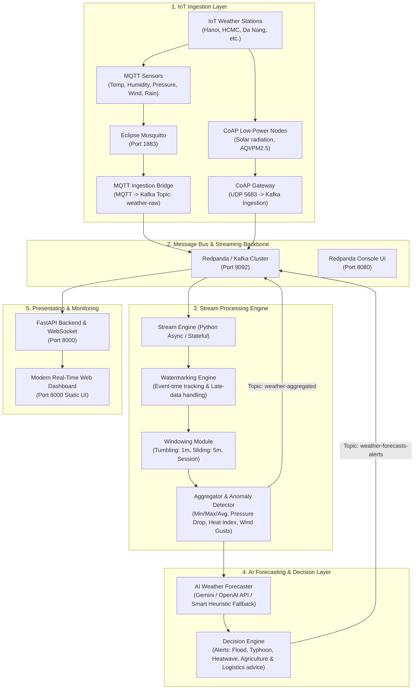

# Architecture & Implementation Plan: AI-Driven IoT Weather Streaming & Forecasting System

Xây dựng hệ thống Data Pipeline hoàn chỉnh thu thập dữ liệu thời tiết IoT theo thời gian thực (Real-Time Ingestion), xử lý dòng dữ liệu (Stream Processing with Windowing, Watermarking, Aggregation), tích hợp AI API phân tích dự báo và đề xuất quyết định thông minh (Decision Intelligence), kèm Docker Compose và Web UI Dashboard trực quan hóa toàn bộ luồng.

---

## 1. System Architecture Overview



---

## 2. Key Components & Specifications

### 2.1 Ingestion Protocols
- **MQTT (Port 1883)**: Phổ biến trong thiết bị IoT công nghiệp/dân dụng. Dữ liệu trạm thời tiết (nhiệt độ, độ ẩm, áp suất khí quyển, tốc độ gió, hướng gió, lượng mưa) được publish định kỳ tới topic `iot/weather/{station_id}`.
- **CoAP (Port 5683/UDP)**: Giao thức Constrained Application Protocol chạy trên UDP tối ưu cho cảm biến năng lượng thấp (chất lượng không khí PM2.5/PM10, bức xạ UV). CoAP Gateway nhận request `POST /telemetry` và forward vào Kafka.
- **Kafka / Redpanda (Port 9092)**:
  - Topic `weather-raw`: Chứa toàn bộ raw telemetry từ mọi trạm và giao thức.
  - Topic `weather-aggregated`: Chứa các kết quả aggregation theo Time Windows.
  - Topic `weather-forecasts-alerts`: Chứa các cảnh báo thiên tai và dự báo từ AI.

### 2.2 Stream Processing Engine
- **Event-Time Processing & Watermarking**:
  - Cơ chế Bounded-Out-Of-Orderness Watermark (cho phép trễ $T$ giây do độ trễ mạng IoT).
  - Tự động phát hiện và xử lý late-arriving events hoặc ghi nhận dropped late events.
- **Windowing Models**:
  - **Tumbling Window (1 phút / 5 phút)**: Tính trung bình, min, max của nhiệt độ, độ ẩm, tốc độ gió.
  - **Sliding Window (5 phút, trượt 1 phút)**: Tính xu hướng biến thiên áp suất (áp suất tụt nhanh > 3hPa/giờ -> cảnh báo bão dông), chỉ số nhiệt (Heat Index), cảnh báo gió giật (Wind Gust).
- **Stateful Aggregation**: Duy trì State Store in-memory / local storage cho từng trạm theo từng time window.

### 2.3 Dataset & Simulator
- **Bộ dữ liệu chuẩn thời tiết**: Tích hợp dataset đa vùng khí hậu (Hà Nội - Cận nhiệt đới gió mùa, TP.HCM - Nhiệt đới gió mùa, Đà Nẵng - Duyên hải miền Trung, Sa Pa - Núi cao, Tokyo, Singapore).
- **IoT Weather Simulator**: Khả năng giả lập trạm phát liên tục với các kịch bản thời tiết cực đoan (Bão nhiệt đới/áp thấp, Nắng nóng cực đoan, Mưa lũ bất ngờ, Hiện tượng đảo nhiệt đô thị).

### 2.4 AI Weather Forecasting & Decision Intelligence
- **AI Integration**: Tích hợp Google Gemini API (hoặc OpenAI API) cùng bộ prompt kỹ thuật khí tượng chuyên sâu.
- **Phân tích thông minh**:
  - Đánh giá chỉ số rủi ro (Risk Score 1-100).
  - Dự báo xu hướng thời tiết 6h - 24h tới dựa trên chuỗi dữ liệu Stream Aggregation.
  - Sinh khuyến nghị vận hành cụ thể cho các ngành:
    - **Nông nghiệp**: Lịch tưới tiêu, phòng ngừa sương muối / cháy lá.
    - **Hạ tầng đô thị**: Điều tiết trạm bơm chống ngập úng.
    - **Logistics / Hàng hải**: Cảnh báo tàu thuyền cấm ra khơi khi gió giật cấp 6+.
- **Offline / Fallback Mode**: Tự động chuyển sang mô hình Heuristic & Statistical Rule-based AI Engine khi không có API Key để hệ thống chạy 100% độc lập, không bị gián đoạn.

### 2.5 Real-Time Web UI Dashboard
- **Giao diện hiện đại (Modern Glassmorphic Dark UI)**:
  - Bản đồ các trạm quan trắc IoT tương tác thời gian thực.
  - Bảng đồng hồ Telemetry (Nhiệt độ, Độ ẩm, Áp suất, Gió, PM2.5, UV).
  - Biểu đồ Windowing & Aggregation trực quan (Sliding vs Tumbling).
  - Live Watermark vs Event-Time tracker.
  - AI Forecast Card & Critical Operations Alert Feed.
  - Điều khiển bộ giả lập (Bật/tắt kịch bản bão, nhiệt độ, tần suất phát).

---

## 3. Proposed Project Structure

```
AI-Driven_Smart_Operations- _From_Real-Time_IoT_Data_to_Intelligent_Decisions/
├── docker-compose.yml              # Toàn bộ orchestration Redpanda, Mosquitto, Ingestion, Stream Engine, AI, UI
├── .env.example                    # Cấu hình môi trường (API Key, ports, Kafka brokers)
├── config/
│   └── mosquitto.conf              # Cấu hình Mosquitto MQTT broker
├── data/
│   ├── stations.json               # Danh mục trạm quan trắc thời tiết IoT
│   └── historical_weather_sample.json # Dataset mẫu đa địa phương
├── src/
│   ├── ingestion/
│   │   ├── mqtt_bridge.py          # MQTT Consumer -> Kafka Producer
│   │   ├── coap_gateway.py         # CoAP Server (UDP) -> Kafka Producer
│   │   └── simulator.py            # Giả lập trạm IoT Weather phát MQTT & CoAP
│   ├── stream_engine/
│   │   ├── watermark.py            # Quản lý Watermark & Late Data
│   │   ├── windowing.py            # Tumbling & Sliding Window Manager
│   │   ├── aggregators.py          # Hàm tổng hợp dữ liệu, tính HeatIndex, Barometric Trend
│   │   └── processor.py            # Stream Consumer & Processor Loop
│   ├── ai_intelligence/
│   │   ├── forecaster.py           # Gemini / OpenAI API AI Client & Prompt Template
│   │   ├── decision_rules.py       # Bộ quy tắc vận hành thông minh (Smart Operations)
│   │   └── fallback_forecaster.py  # AI Heuristic Fallback khi không có API key
│   └── backend/
│       ├── main.py                 # FastAPI Application + WebSockets
│       └── static/
│           ├── index.html          # Modern Dashboard UI
│           ├── style.css           # Glassmorphism Dark Theme Styling
│           └── app.js              # Real-time WebSocket charts & map logic
├── Dockerfile                      # Multi-service / Service container definitions
└── README.md                       # Tài liệu hướng dẫn sử dụng và kiến trúc chi tiết
```

---

## 4. Verification Plan

### Automated & Integration Tests
1. **Docker Compose Launch**:
   - `docker compose up -d` kiểm tra khởi động thành công Redpanda, Mosquitto, Ingestion Bridge, Stream Engine, Backend.
2. **Ingestion Verification**:
   - Kiểm tra MQTT subscriber nhận data từ `iot/weather/#`.
   - Kiểm tra CoAP client gửi payload UDP tới CoAP gateway.
   - Kiểm tra Kafka topic `weather-raw` nhận đầy đủ records.
3. **Stream Processing Engine Verification**:
   - Xác minh Watermarking tính đúng trễ (out-of-order latency).
   - Xác minh Tumbling 1m & Sliding 5m window aggregation xuất ra `weather-aggregated`.
4. **AI & Decision Verification**:
   - Test AI inference với Gemini/OpenAI API và kiểm tra fallback heuristic khi offline.
   - Xác minh các cảnh báo bão (Typhoon Alert), nắng nóng cực đoan (Heatwave Alert).
5. **UI & End-to-End Test**:
   - Mở Dashboard trên browser, kiểm tra kết nối WebSocket nhận live metrics, hiển thị biểu đồ và AI alerts mượt mà.

---

## 5. User Review Required

> [!NOTE]
> Hệ thống được thiết kế hoàn toàn sẵn sàng chạy bằng Docker Compose (`docker compose up --build`).
> Hỗ trợ cấu hình `GEMINI_API_KEY` hoặc `OPENAI_API_KEY` trong file `.env`. Nếu không truyền API Key, hệ thống sẽ tự kích hoạt **AI Fallback Meteorological Intelligence Engine** được xây dựng sẵn để sinh dự báo và quyết định thông minh ngay lập tức!
